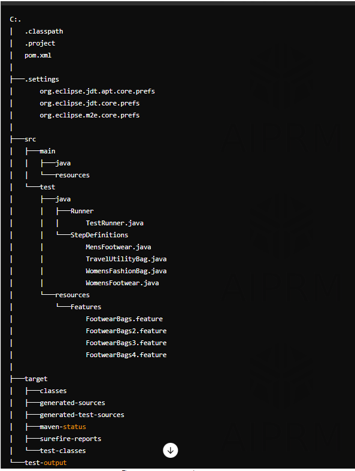

# Naaptol - Footwear & Bags (Cucumber Testing)

## Introduction

This project focuses on the automated testing of the "Footwear & Bags" section of the Naaptol website. The primary goal is to verify that users can efficiently browse, select products, and use the provided filters for an enhanced shopping experience.

## Project Type

- Automation Testing
- Frontend Testing
- Software Automation Engineer in Test (SDET)

## Directory Structure

The project is organized as follows:
C:\Users\Abhisek Baral\Documents\workspace-spring-tool-suite-4-4.23.1.RELEASE\SeleniumProject1

## Video Walkthroughs

- **Project Overview:** [Watch Here](https://youtu.be/sh6sLfoc5pI?si=NQJn_-KvtDZtGE1m)
- **Project questionnaire:** [Watch Here](https://youtu.be/LAWTVI4Wi4M?si=O3eUkzoVhmgTWFyh)
- **Functionality Screenshot:** [View Here](https://drive.google.com/drive/folders/1ipU4h2rKuSLtwfeXn5RcAfHzkWTfO19h?usp=sharing)

## Features

1. Users can select products from the "Footwear & Bags" section in Shopping Categories.
2. Users can apply filters from the left-hand side *Personalise Search* for more refined search results.

## Design Decisions & Assumptions

The project is designed with the following categories:

- **Shopping Categories**
  - **Footwear & Bags**
    - **Men's Footwear**
      - Footwear Combos
      - Boots
      - Sports Shoes
      - Formal Shoes
      - Sandals & Slippers
    - **Women's Footwear**
      - Womens Sandals
    - **Women Fashion Bags**
      - Handbags & Clutches
    - **Travel & Utility Bags**
      - Backpack
      - Duffle Bag & Strolleys

## Installation & Getting Started

To set up and start the project, follow these steps:

1. Open the project in Spring Tool Suite.
2. Create a new Maven project.
3. Add the necessary dependencies and create packages.
4. Create a Java class for the testing script.
5. Write Selenium scripts to automate the test cases.

## Functionality Usage

1. Open the Naaptol website in a browser.
2. Navigate to the "Shopping Categories."
3. Select "Footwear & Bags."
4. Explore all provided links.
5. Apply the *Personalise Search* filters feature.
6. Select a product from the filtered results.
7. Navigate the new tab.
8. Add the product to the cart.
9. Renavigate to main tab
10. Return to the home page.

## Technology Stack

- Java
- Selenium

write readme for github
